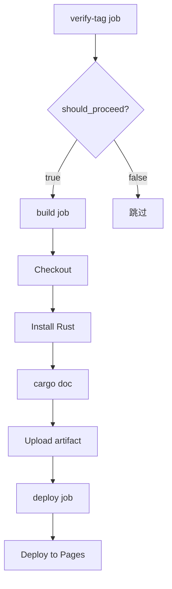
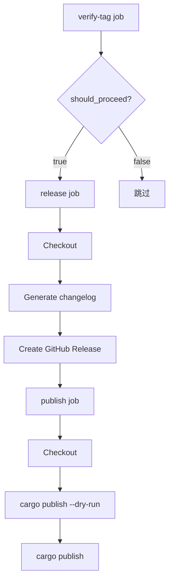
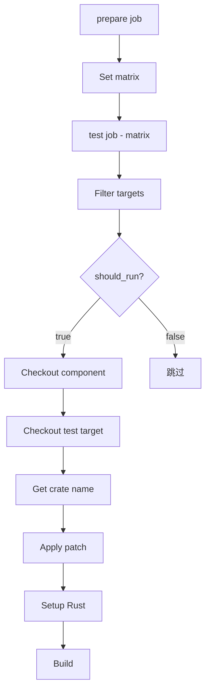
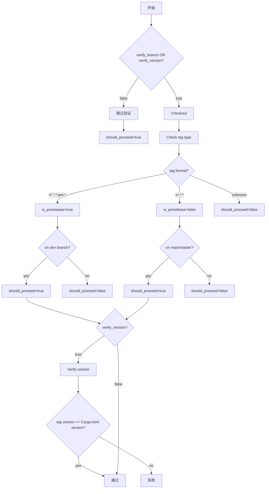

# Axci

共享 CI 工作流集合，用于 ArceOS Hypervisor 生态的各个 `no_std` 组件。

## 概述

### 设计

本仓库提供可复用的 GitHub Actions 工作流，组件仓库可以通过 `workflow_call` 引用这些工作流，避免在每个组件中重复维护 CI 配置。

**工作流列表：**

| 工作流 | 功能 |
|--------|------|
| `check.yml` | 代码质量检查（fmt、clippy、build、doc） |
| `test.yml` | 集成测试（通过 axtest 框架） |
| `verify-tag.yml` | 验证版本标签（分支、版本一致性） |
| `deploy.yml` | 部署文档到 GitHub Pages |
| `release.yml` | 创建 GitHub Release 并发布到 crates.io |

**目录结构：**

```
axci/
├── .github/
│   └── workflows/
│       ├── check.yml        # 代码检查
│       ├── test.yml         # 集成测试
│       ├── verify-tag.yml   # 标签验证
│       ├── deploy.yml       # 文档部署
│       └── release.yml      # 发布
└── README.md
```

## Check

### 设计

`check.yml` 工作流执行代码质量检查，确保代码符合规范并能正确编译。

**执行过程：**


**详细步骤：**

1. **Checkout** - 检出代码
2. **Install Rust** - 安装 nightly 工具链及指定组件
3. **Check code format** - `cargo fmt --all -- --check`
4. **Build** - `cargo build --target <target> [--all-features]`
5. **Run clippy** - `cargo clippy --target <target> [--all-features] -- -D warnings`
6. **Build documentation** - `cargo doc --no-deps --target <target> [--all-features]`
   - 设置 `RUSTDOCFLAGS: -D rustdoc::broken_intra_doc_links -D missing-docs`

**输入参数：**

| 参数 | 说明 | 默认值 |
|------|------|--------|
| `all_features` | 是否使用 --all-features 标志 | true |
| `targets` | 编译目标 (JSON 数组) | `["aarch64-unknown-none-softfloat"]` |
| `rust_components` | Rust 组件 (逗号分隔) | `rust-src, clippy, rustfmt, llvm-tools` |

### 使用

在组件仓库创建 `.github/workflows/check.yml`：

```yaml
name: Check

on:
  push:
    branches: ['**']
    tags-ignore: ['**']
  pull_request:

jobs:
  check:
    uses: arceos-hypervisor/axci/.github/workflows/check.yml@main
```

**带可选参数：**

```yaml
jobs:
  check:
    uses: arceos-hypervisor/axci/.github/workflows/check.yml@main
    with:
      all_features: false
      targets: '["aarch64-unknown-none"]'
      rust_components: 'rust-src, clippy'
```

## Deploy

### 设计

`deploy.yml` 工作流将文档部署到 GitHub Pages。

**执行过程：**



**详细步骤：**

1. **verify-tag job** - 调用 `verify-tag.yml` 验证标签合法性
2. **build job** - 构建文档
   - Checkout - 检出代码
   - Install Rust - 安装 nightly 工具链
   - Build docs - `cargo doc --no-deps --all-features`
     - 设置 `RUSTDOCFLAGS: -D rustdoc::broken_intra_doc_links -D missing-docs`
     - 生成重定向首页 `index.html`
   - Upload artifact - 上传文档产物
3. **deploy job** - 部署到 GitHub Pages
   - 使用 `actions/deploy-pages@v4` 部署

**输入参数：**

| 参数 | 说明 | 默认值 |
|------|------|--------|
| `verify_branch` | 验证标签是否在 main/master 分支 | true |
| `verify_version` | 验证 Cargo.toml 版本与标签一致 | true |

### 使用

在组件仓库创建 `.github/workflows/deploy.yml`，推荐在版本标签推送时触发：

```yaml
name: Deploy

on:
  push:
    tags:
      - 'v[0-9]+.[0-9]+.[0-9]+'

jobs:
  deploy:
    uses: arceos-hypervisor/axci/.github/workflows/deploy.yml@main
```

## Release

### 设计

`release.yml` 工作流创建 GitHub Release 并发布到 crates.io。

**执行过程：**



**详细步骤：**

1. **verify-tag job** - 调用 `verify-tag.yml` 验证标签合法性
2. **release job** - 创建 GitHub Release
   - Checkout - 检出代码（完整历史）
   - Generate release notes - 从上一个 tag 生成 changelog
     - `git log --pretty=format:"- %s (%h)" "${PREV_TAG}..${CURRENT_TAG}"`
   - Create GitHub Release - 使用 `softprops/action-gh-release@v2`
     - 稳定版本：`prerelease: false`
     - 预发布版本：`prerelease: true`
3. **publish job** - 发布到 crates.io
   - Checkout - 检出代码
   - Install Rust - 安装 nightly 工具链
   - Dry run publish - `cargo publish --dry-run`
   - Publish to crates.io - `cargo publish --token $CARGO_REGISTRY_TOKEN`

**输入参数：**

| 参数 | 说明 | 默认值 |
|------|------|--------|
| `verify_branch` | 验证标签是否在正确分支 | true |
| `verify_version` | 验证 Cargo.toml 版本与标签一致 | true |

**Secrets：**

| Secret | 说明 |
|--------|------|
| `CARGO_REGISTRY_TOKEN` | crates.io 的 API token |

### 使用

在组件仓库创建 `.github/workflows/release.yml`，推荐在版本标签推送时触发：

```yaml
name: Release

on:
  push:
    tags:
      - 'v[0-9]+.[0-9]+.[0-9]+'
      - 'v[0-9]+.[0-9]+.[0-9]+-pre.[0-9]+'

jobs:
  release:
    uses: arceos-hypervisor/axci/.github/workflows/release.yml@main
    secrets:
      CARGO_REGISTRY_TOKEN: ${{ secrets.CARGO_REGISTRY_TOKEN }}
```

**版本发布流程：**

稳定版本：
```bash
# 1. 更新 Cargo.toml 中的版本号
# 2. 提交并推送到 main/master
git commit -am "chore: release v1.0.0"
git push origin main

# 3. 创建标签
git tag v1.0.0
git push origin v1.0.0
```

预发布版本：
```bash
# 1. 在 dev 分支工作
git checkout dev

# 2. 更新版本号
# 3. 提交并推送
git commit -am "chore: release v1.0.0-pre.1"
git push origin dev

# 4. 创建标签
git tag v1.0.0-pre.1
git push origin v1.0.0-pre.1
```

## Test

### 设计

`test.yml` 工作流运行集成测试，通过 patch 方式将组件集成到测试目标中构建验证。

**执行过程：**



**详细步骤：**

1. **prepare job** - 准备测试矩阵
   - 输出默认测试目标配置（axvisor, starry）
2. **test job** - 并行执行测试（每个 target 一个 job）
   - Filter test targets - 根据 `test_targets` 输入过滤
   - Checkout component - 检出被测组件到 `component/`
   - Checkout test target - 检出测试目标仓库到 `test-target/`
   - Get component crate name - 从 Cargo.toml 检测或使用输入值
   - Apply patch to Cargo.toml - 添加 `[patch.crates-io]` 覆盖依赖
   - Setup Rust - 安装 nightly 工具链
   - Build - 执行构建命令（带超时控制）

**输入参数：**

| 参数 | 说明 | 默认值 |
|------|------|--------|
| `crate_name` | 组件 crate 名称 | 自动检测 |
| `test_targets` | 测试目标（逗号分隔或 "all"） | all |
| `skip_build` | 跳过构建 | false |

**默认测试目标：**
- `axvisor` - https://github.com/arceos-hypervisor/axvisor
- `starry` - https://github.com/Starry-OS/StarryOS

### 使用

在组件仓库创建 `.github/workflows/test.yml`：

```yaml
name: Test

on:
  push:
    branches: [master, main, dev]
    tags-ignore: ['**']
  pull_request:
  workflow_dispatch:

jobs:
  test:
    uses: arceos-hypervisor/axci/.github/workflows/test.yml@main
```

**带可选参数：**

```yaml
jobs:
  test:
    uses: arceos-hypervisor/axci/.github/workflows/test.yml@main
    with:
      crate_name: 'arm_vcpu'
      test_targets: 'axvisor'
```

## 附录：verify-tag.yml

`verify-tag.yml` 是内部工作流，被 `deploy.yml` 和 `release.yml` 调用，用于验证版本标签的合法性。

**执行过程：**



**详细步骤：**

1. **Skip all verifications** - 如果 `verify_branch=false` 且 `verify_version=false`，直接通过
2. **Checkout code** - 检出代码（完整历史）
3. **Check tag type and branch** - 检查标签类型和分支
   - 预发布标签 `v*.*.*-pre.*` 必须在 `dev` 分支
   - 稳定标签 `v*.*.*` 必须在 `main` 或 `master` 分支
   - 未知格式标签拒绝通过
4. **Verify version consistency** - 验证版本一致性（如果 `verify_version=true`）
   - 比较标签版本与 `Cargo.toml` 中的 `version` 字段

**输入参数：**

| 参数 | 说明 | 默认值 |
|------|------|--------|
| `verify_branch` | 验证标签是否在正确分支 | true |
| `verify_version` | 验证 Cargo.toml 版本与标签一致 | true |

**输出：**

| 输出 | 说明 |
|------|------|
| `should_proceed` | 是否继续执行 deploy/release |
| `is_prerelease` | 是否为预发布标签 |

## License

Apache-2.0
